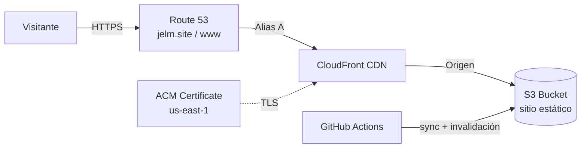

# Portafolio de Jorge León

Sitio web profesional de **Jorge León**, Especialista en Infraestructura TI con más de 10 años de experiencia en infraestructura, cloud y gestión de servicios.

🌐 **Sitio en vivo:** https://jelm.site

[](https://github.com/jorgeleonm/portfolio/actions/workflows/deploy.yml)

## 📋 Descripción

Portafolio responsivo construido con HTML, CSS y JavaScript puro, sin frameworks ni dependencias externas. Se aloja en AWS con S3 y CloudFront, y se despliega automáticamente con GitHub Actions en cada push a `main`.

## 🏗️ Arquitectura



| Componente | Función |
|---|---|
| **Route 53** | DNS de `jelm.site` y `www.jelm.site`, con registros Alias hacia CloudFront |
| **ACM** | Certificado SSL/TLS público y gratuito, validado por DNS y renovado automáticamente (en us-east-1, requisito de CloudFront) |
| **CloudFront** | CDN global con HTTPS y caché en ubicaciones de borde |
| **S3** | Almacenamiento privado y cifrado de los archivos estáticos, accesible solo desde CloudFront (OAC) |
| **GitHub Actions** | Pipeline de despliegue continuo |

## 🚀 Pipeline de despliegue (CI/CD)

Cada push a `main` ejecuta el workflow [`deploy.yml`](.github/workflows/deploy.yml), que hace lo siguiente:

1. Obtiene el código del repositorio.
2. Se autentica en AWS con credenciales IAM guardadas en GitHub Secrets.
3. Sincroniza los archivos con el bucket S3 (`aws s3 sync --delete`), excluyendo los archivos que no forman parte del sitio (`.git`, `.github`, `*.md`, `.gitignore`).
4. Invalida la caché de CloudFront para que los visitantes vean la versión nueva de inmediato.

El despliegue completo tarda alrededor de 20 segundos. También se puede lanzar manualmente desde la pestaña **Actions** (`workflow_dispatch`).

### Verificar un despliegue

```bash
# Primera petición después de la invalidación: "Miss from cloudfront"
# Peticiones siguientes: "Hit from cloudfront"
curl -sI https://jelm.site | grep -i x-cache
```

## 🧭 Decisiones de diseño

- **Migración desde EC2:** el sitio se servía inicialmente desde una instancia EC2 t3.micro. Lo migré a S3 + CloudFront para eliminar la administración del servidor (parches, reinicios, monitoreo), reducir costos y mejorar los tiempos de carga con la CDN.
- **Arquitectura serverless:** al ser un sitio estático, no hace falta un servidor encendido. S3 y CloudFront escalan solos y el costo depende del tráfico real.
- **HTTPS con certificado gestionado:** ACM emite y renueva el certificado sin intervención manual.
- **Bucket privado con Origin Access Control (OAC):** el bucket S3 no es público; solo CloudFront puede leer sus objetos, mediante una política que autoriza únicamente a esta distribución. Block Public Access está activado y los archivos se cifran en reposo (SSE-S3). Todo el tráfico pasa por la CDN y por HTTPS.
- **Invalidación en cada despliegue:** evita que CloudFront siga sirviendo la versión anterior hasta que expire su caché.
- **Página de error personalizada:** CloudFront convierte los errores 403 y 404 del origen en una respuesta `404` con `404.html`. Con OAC, S3 responde 403 ante archivos inexistentes para no revelar qué objetos hay en el bucket; esta regla hace que el visitante vea una página útil en lugar del XML de AWS.

## 📁 Estructura

```
portfolio/
├── .github/
│   └── workflows/
│       └── deploy.yml   # Pipeline de despliegue a S3 + CloudFront
├── index.html           # Página principal
├── 404.html             # Página de error personalizada
├── styles.css           # Estilos (con variables CSS)
├── script.js            # Interactividad
├── README.md            # Este archivo
└── .gitignore           # Archivos ignorados por Git
```

## 🛠️ Desarrollo local

1. Clona el repositorio:

```bash
git clone https://github.com/jorgeleonm/portfolio.git
cd portfolio
```

2. Levanta un servidor local:

```bash
python3 -m http.server 8000
```

3. Abre http://localhost:8000 en el navegador.

## 🤝 Contacto

- 📧 Email: [jorgeleonm@gmail.com](mailto:jorgeleonm@gmail.com)
- 💼 LinkedIn: [linkedin.com/in/jorgeleonm](https://linkedin.com/in/jorgeleonm)
- 🐙 GitHub: [@jorgeleonm](https://github.com/jorgeleonm)
- 📍 Guayaquil, Ecuador

## 📝 Licencia

Todos los derechos reservados © 2026 Jorge Enrique León Mera.
